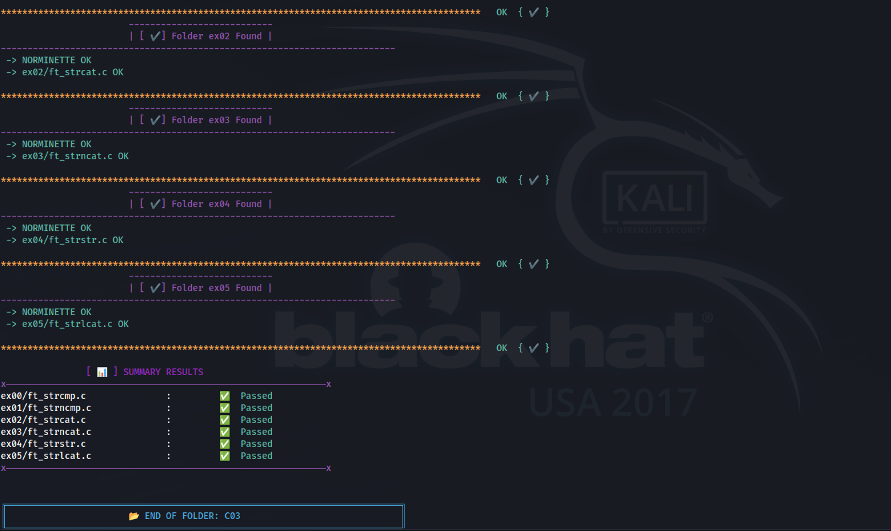

# ziTester


## Table of Contents

- [Installation](#installation)
- [Usage](#usage)
- [Contributing](#contributing)
- [License](#license)

## OVERVIEW

ziTester is a tool designed to test and verify the status of exercise files for 42 School students. It runs shell scripts to check each exercise and updates the results accordingly.



## FEATURES

- **File Existence Check**: Verifies if the exercise file exists.
- **Shell Script Execution**: Runs specific shell scripts to test each exercise.
- **Status Reporting**: Updates the status of each exercise based on the test results.

## INSTALLATION

* **FOR `zsh` :**

    ```sh
    zsh -c "$(curl -fsSL https://raw.githubusercontent.com/mirr-x/ziTester/main/bin/install.sh)"
    ```

* **FOR `bash` :**

    ```sh
    bash -c "$(curl -fsSL https://raw.githubusercontent.com/mirr-x/ziTester/main/bin/install.sh)"
    ```


## INSTRUCTIONS

*After installation, you can use ziTester to check your exercise files. Navigate to the directory containing your exercise files and run the following command `zi C00`:*

```
     _ _____          _            
 ___(_)__   \___  ___| |_ ___ _ __ 
|_  / | / /\/ _ \/ __| __/ _ \ '__|
 / /| |/ / |  __/\__ \ ||  __/ |   
/___|_|\/   \___||___/\__\___|_|   
                                   
                                zi!


xxxxxxxxxxxxxxxxxxxxxxxxxxxxxxxxxxxxxxxxxxxxxxxxxxxxxxxxxxxxxxxxxxxxxxxxxxx
                                                                          X
INSTRUCTIONS:                                                             X
                                                                          X
        • USAGE:                                                          X
            $ > zi [FOLDER NAME]                                          X
                                                                          X
        • EXAMPLE:                                                        X
            $ > zi C05                                                    X
                                                                          X
                                                                          X
--------------------------------------------------------------------------%
Made By: mirr-x              &&     Made By: mdbentaleb                   |
https://github.com/mirr-x    &&     https://github.com/mdbentaleb         |
--------------------------------------------------------------------------%
```

## TUTORIAL

https://github.com/user-attachments/assets/eeac925b-3145-49bb-acf1-967a6e46c4c6

## Progress

| Day  | Status |
|------|--------|
| SH0  | KO     |
| SH1  | KO     |
| C00  | OK     |
| C01  | OK     |
| C02  | OK     |
| C03  | OK     |
| C04  | OK     |
| C05  | OK     |
| C06  | KO     |
| C07  | KO     |
| C08  | KO     |
| C09  | KO     |


> **NOTE**:
*your folder name must be a capital like this C00 C01 ...*

